# GitDiagram architecture — @konitif/ui

This architecture view was generated from the public repository by [GitDiagram](https://gitdiagram.com/lemouf/konitif-ui) on 2026-09-20 19:02:52 UTC.

It is a documentation projection of the repository tree, README, and source files sampled by GitDiagram. It does not replace the authored contracts in [catalog.json](catalog.json) and [diagrams.json](diagrams.json), nor does it establish runtime authority.

The Mermaid source keeps GitDiagram's groups, nodes, relationships, and source links. GitDiagram's forced color classes and HTML line breaks are omitted so the diagram remains readable in local previews and dark themes.

- Public repository: [konitif-ui](https://github.com/LeMouf/konitif-ui)
- Interactive diagram: [Open in GitDiagram](https://gitdiagram.com/lemouf/konitif-ui)

## Architecture diagram

```mermaid
flowchart TD

subgraph group_entry["Launch Entry"]
  node_launch["Launch Surface — [LaunchRoot.svelte]"]
  node_project_gate["Repository Gate"]
end

subgraph group_workspace["Shell Workspace"]
  node_app_shell["App Shell — [AppShell.svelte]"]
  node_shell_layout["Shell Layout"]
  node_workspace_view["Workspace View"]
  node_resize_controller["Resize Controller"]
  node_gesture_engine["Gesture Engine"]
  node_tool_host["Tool Host — [ToolHost.svelte]"]
  node_widget_host["Widget Host"]
  node_drag_preview["Widget Drag Preview"]
end

subgraph group_insights["Insights Projections"]
  node_runtime_observability["Runtime Observability"]
  node_technical_docs["Technical Docs"]
  node_projection_engine["Projection Engine"]
  node_perception_engine["Perception Engine"]
  node_semantic_graph["Semantic Graph"]
end

subgraph group_shared["Shared UI"]
  node_themes["Theme Runtime"]
  node_localization["Localization Helpers — [workbenchI18n.ts]"]
  node_icons["Icon Registry — [iconRegistry.ts]"]
  node_primitives["UI Primitives — [ControlDock.svelte]"]
  node_audio_meter["Audio Meter"]
end

node_host(("Application Host"))
node_workbench{{"Workbench Contracts"}}

node_host -->|"opens"| node_launch
node_host -->|"mounts"| node_app_shell
node_launch -->|"presents"| node_project_gate
node_app_shell -->|"renders"| node_shell_layout
node_shell_layout -->|"hosts"| node_workspace_view
node_shell_layout -->|"arranges"| node_widget_host
node_shell_layout -->|"reads"| node_themes
node_workspace_view -->|"dispatches"| node_resize_controller
node_resize_controller -->|"calls"| node_gesture_engine
node_resize_controller -->|"uses types"| node_workbench
node_workspace_view -->|"hosts"| node_tool_host
node_shell_layout -->|"renders"| node_drag_preview
node_drag_preview -->|"renders"| node_icons
node_drag_preview -->|"translates"| node_localization
node_project_gate -->|"renders"| node_icons
node_project_gate -->|"translates"| node_localization
node_technical_docs -->|"projects"| node_projection_engine
node_technical_docs -->|"perceives"| node_perception_engine
node_projection_engine -->|"reads"| node_semantic_graph
node_perception_engine -->|"reads"| node_semantic_graph
node_app_shell -->|"exposes"| node_runtime_observability
node_app_shell -->|"uses"| node_primitives
node_app_shell -.->|"exposes"| node_audio_meter

click node_launch "https://github.com/lemouf/konitif-ui/blob/main/src/launch/LaunchRoot.svelte"
click node_project_gate "https://github.com/lemouf/konitif-ui/blob/main/src/launch/components/organisms/ProjectGateRepositoryDetail.svelte"
click node_app_shell "https://github.com/lemouf/konitif-ui/blob/main/src/shell/AppShell.svelte"
click node_shell_layout "https://github.com/lemouf/konitif-ui/blob/main/src/shell/layout/AppShellMainContentLayout.svelte"
click node_workspace_view "https://github.com/lemouf/konitif-ui/blob/main/src/layout/WorkspaceView.svelte"
click node_resize_controller "https://github.com/lemouf/konitif-ui/blob/main/src/layout/workspaceNodeResizeController.ts"
click node_gesture_engine "https://github.com/lemouf/konitif-ui/blob/main/src/layout/resizeGestureEngine.ts"
click node_tool_host "https://github.com/lemouf/konitif-ui/blob/main/src/layout/ToolHost.svelte"
click node_widget_host "https://github.com/lemouf/konitif-ui/blob/main/src/widgets/WidgetDockHost.svelte"
click node_drag_preview "https://github.com/lemouf/konitif-ui/blob/main/src/shell/ShellWidgetDragPreview.svelte"
click node_runtime_observability "https://github.com/lemouf/konitif-ui/blob/main/src/shell/RuntimeObservabilityPanel.svelte"
click node_technical_docs "https://github.com/lemouf/konitif-ui/blob/main/src/shell/TechnicalDocsView.svelte"
click node_projection_engine "https://github.com/lemouf/konitif-ui/blob/main/src/shell/technical-docs/architectureProjectionEngine.ts"
click node_perception_engine "https://github.com/lemouf/konitif-ui/blob/main/src/shell/technical-docs/architecturePerceptionEngine.ts"
click node_semantic_graph "https://github.com/lemouf/konitif-ui/blob/main/src/shell/technical-docs/semanticArchitectureGraphModel.ts"
click node_themes "https://github.com/lemouf/konitif-ui/blob/main/src/themes/workbenchThemeRuntime.ts"
click node_localization "https://github.com/lemouf/konitif-ui/blob/main/src/i18n/workbenchI18n.ts"
click node_icons "https://github.com/lemouf/konitif-ui/blob/main/src/icons/iconRegistry.ts"
click node_primitives "https://github.com/lemouf/konitif-ui/blob/main/src/primitives/ControlDock.svelte"
click node_audio_meter "https://github.com/lemouf/konitif-ui/blob/main/src/audio/stereoAudioMeter.ts"

```

## Generated analysis

@konitif/ui is a reusable Svelte presentation layer for KONITIF Workbench applications. The principal workflow is: a host opens launch/project-gate surfaces, enters the AppShell, arranges workspace panels and tools, and receives themed, localized runtime and documentation projections. Workspace resizing is an explicit interaction stage, while technical-documentation graphs and observability remain projections of supplied evidence. The map emphasizes sampled runtime code and README-defined capabilities; unsampled component wiring is shown only at the product-surface level.
